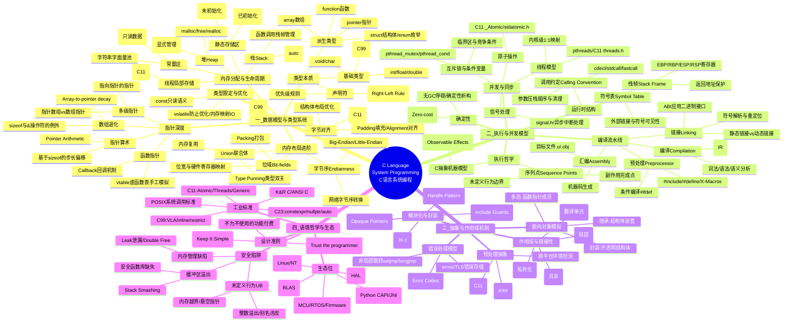

# C 语言底层架构与设计哲学 - 深度全景思维导图

这是一个极尽详尽的 C 语言系统架构思维导图，涵盖了类型系统、执行模型、抽象机制和设计哲学四个核心维度。

## 跨分支逻辑关联

以下是关键知识点之间的逻辑关联：

| 源节点 | 目标节点 | 关联说明 |
|--------|----------|----------|
| **内存分配** (堆Heap) | **指针深度** (多级指针) | 堆分配必须通过指针访问，是内存动态性的基础 |
| **符号表** | **外部链接extern** | 链接器通过符号表解析外部链接符号 |
| **静态存储区** (.data/.bss) | **内部链接static** | static变量存储于静态区，具有内部链接属性 |
| **栈帧Stack Frame** | **块作用域Block Scope** | 块作用域变量的生命周期与栈帧绑定 |
| **未定义行为UB** | **序列点Sequence Points** | 序列点之间的操作顺序是UB的主要来源 |
| **调用约定** | **函数指针** | 函数指针调用必须遵循约定声明的方式 |
| **字节序Endianness** | **位域Bit-fields** | 位域的内存表示受字节序影响 |
| **接口分离** (.h/.c) | **头文件保护** | 接口分离依赖头文件保护防止重复包含 |
| **volatile** | **信号处理Signals** | 信号处理函数中的变量必须用volatile修饰 |
| **指针算术** | **数组退化** | 退化后才能进行指针算术操作 |

## 图表说明

- **中心节点**: C Language System Programming (C语言系统编程)
- **四大主维度** (用图标区分):
  - 📊 数据模型与类型系统 - 体现数据本质
  - ⚙️ 执行与并发模型 - 体现动态执行
  - 🎯 抽象与作用域机制 - 体现结构化
  - 💡 语境、哲学与生态 - 体现元认知
- **层级深度**: 4-5 层嵌套
- **兼容性**: 可在 Obsidian、GitHub、Typora 等支持 Mermaid 的环境渲染

---

*生成日期: 2026-02-17*
*使用工具: Mermaid Visualizer Skill*
